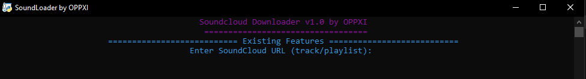

# OPPXI Soundcloud Downloader

## Description
This tool allows users to download tracks or playlists from SoundCloud as MP3 files with appropriate metadata.

# Preview Old

# What Changes:
- Update into GUI for easy and friendly!
- Added `Output Folder: downloads`
- Added `Open Download Folder`
- Toggle Theme (Light/Dark Mode)
- Progress Bar (Gradient)

## Preview Mode (Light)

## Preview Mode (Dark)

## How to Use SoundLoader:
1. Download the file on [Release](https://github.com/oppxi/Soundcloud-Downloader/releases/tag/SoundLoaderV2) Save it into your computer.
2. Double-click oppxi_sc_dwn.exe to run the application.
3. If you see a Windows security warning, click "More info" and "Run anyway".
4. Enter the SoundCloud URL (song or playlist) and click "Download".

## Disclaimer
This tool is provided for educational and personal purposes only. Users are responsible for complying with the SoundCloud terms of service and applicable copyright laws. The creator of this project is not responsible for any misuse of this tool.

## License
Licensed under [GPL-2.0](LICENSE). This project uses third-party libraries:
- `yt-dlp` (Unlicense)
- `mutagen` (GPL-2.0)
- `colorama` (BSD-3-Clause)

See the `NOTICE` file for more details.
